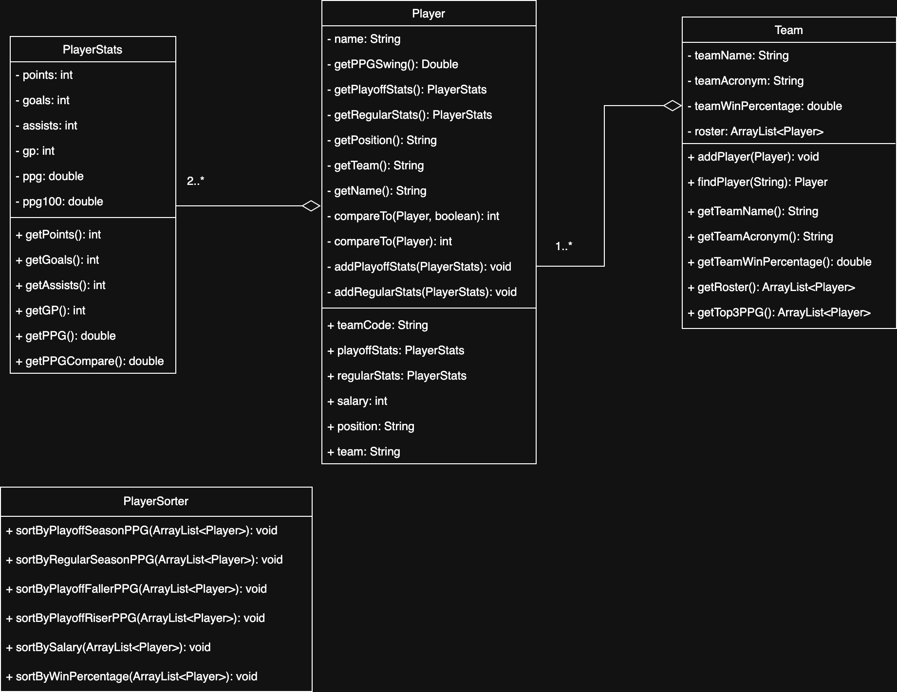

Note: This Project has been forked, non of the original commits are on this Public version
# NHL-Data-Visualizer-Playoff-Champion-or-Choker
### Created by Justin and Joel

## Walkthrough Video

Video Link: https://youtu.be/5Oo6zf9Umqg?si=OrZUlpHuZ052tdbo 

## Our Idea
Ever wondered if your favourite player was a choker or a champion? If they can rise to the occasion during the toughest times or if they crumble under all the pressure? Well that is what we were wondering which is why we decided to graph the data ourselves. 

The main goal of this program is to compare player's regular season PPG and playoff season PPG. This is done by generating double bar graphs for each player which allows for an easy analysis between the two statistics. 

Playoff Season PPG > Regular Season PPG = Playoff Riser
Regular Season PPG > Playoff Season PPG = Playoff Faller

A larger gap between the two stats symbolizes whether or not the player performs better or worse under the playoff pressure.

Of course this isn't all our data shows as we have created various buttons that all change how the players are sorted.

Below is a list of the buttons implemented and the story each button attempts to tell.

*A quick note before we delve into the buttons, to reduce clutter with the graphs, for the win percentage sort, only the top 3 players are used per team, so only (16 x 3) 48 players are displayed. "Top 3" Players were determined by grabbing the player with the highest regular season ppg and then the two non-duplicate players that had the highest playoff season ppg. Higher playoff season ppg players were more emphasized due to the importance and stakes that exist with the playoffs.

#### Sort By Team Win Percentage
- The chart is sorted by Teams win percentage from the regular season. 
- The top 3 players from each are placed on the chart, these are usually the star players, their production usually correlates to their team success. 
- The main comparator is Regular Season PPG vs Win %. 
- Of course there are outliers, one noteable is Connor McDavid who is AWESOME at anytime of year so his performance just towers everyone elses, while his team is quite bad rendering a lower Win %.
- **DISCLAIMER: Search and filters cannot be used with this graph, this is meant to show a general overview of the entire league with every team being represented**

#### Sort By Player Salary
- This chart is sorted by the Salary of Each Player. 
- The main comparator here is overall production. 
- This asks can a player show what he is worth in both the regular season and the playoff season. 
- Noteable outlier here is Drew Doughty, as he is a defencemen his tasks are not focused on gaining points, but blocking goals, so a defencemen might have lower PPG.  
- On the other end of the spectrum, we have Auston Matthews, a player notorious for crumbling in the playoffs and his ppg swing stat clearly displays this. This brings up the question, is he truly worth what he is getting paid?

#### Sort By Playoff Risers
- This chart sorts the ppg swing of players from highest to lowest PPG Swing.
- This sorting method is meant the highlight the increase in a player's overall production, showing how much better do these players play during the playoff season. 
- PPG Swing is a term that we created and used throughout the course of the project. 
- It follows the simple calculation Playoff PPG - Regular Season PPG, and in essence it displays how the player performs under the pressure of the playoffs.
- A positive PPG Swing = Playoff riser 
- A negative PPG Swing = Playoff faller (Which is displayed in the next sort)
- A lot of Defencemen tend to be risers as they don't have much oppurtunity in the regular season to score, but in the playoffs anyone and everyone is attempting to score, such as Evan Bouchard.

#### Sort By Playoff Fallers
- This chart sorts the PPG Swing of players from lowest to highest PPG Swing
- The sorting method highlights how much worse certain players play during the post season. 
- The previous Playoff Risers description explains the PPG Swing term
- A lot of players that are first round exits have low PPG as they don't get enough games to show their potential, especially if they were swept. 
- A good example is Alexander Ovechkin as he was swept, performing poorly in his games, and was therefore listed as a massive faller.

#### Sort By Highest Playoff Season PPG
- This chart is sorts players by their Playoff PPG, going from greatest to least. 
- Teams that tend to have more playoff risers tend to have a better chance to move through the playoffs. 
- An anomaly would be the Edmonton Oilers. Their core has such a great production in the regular season that their players do ever so slightly worse and they are considered as playoff fallers. 
    - Heck McDavid has the best PPG in the playoffs and is considered a playoff faller. Overall their team is efficient and did get to the finals.

#### Sort By Highest Regular Season PPG
- This chart sorts players by their Regular season PPG, going from greatest to least 
- Teams with players in the top here usually have a Super Star, i.e. the Toronto Maple Leafs have a goal producing Auston Matthews. 
- A Team with great Regular Season Points production doesn't guarentee success in the playoffs. 
- An Anamoly would be the Toronto Maple Leafs. Three of their players make the top 16 Regular Season PPG players, but come playoff time the team likes to choke, with NONE of these stars appearing in the previous playoff ppg category.

### Individual Records (Popup Windows)
- A player's individual record can be viewed by clicking either of their bars in the bar chart, which will open up a new window to view stats in
- If a player isn't easily visible in any of the default sorts, you can search their name in the search bar and click on their bars from there
- The Indivdual records display all the stats of both Regular and Playoff Season 
- It also shows additional details such as Salary, PPG Swing, Riser or Faller, 
- In the center, a dedicated bar graph exists to compare their Regular Season and Playoff PPG
- On the far right, a whole section dedicated to PPG Swing is displayed
    - The top 3 players from every single team have their PPG swing plotted along a number line in grey
    - The currently selected player will also appear on the number line, with their point being highlighted in red
    - The overall league average PPG swing is also displayed in blue, so you can see where the selected player stands relative to the league
    - Interestingly enough the league average dips slightly into the negative, highlighting how many players struggle with the pressure of the playoffs, and bringing light to the stars who are able to rise.

### Filtered Search Option
Within our program there are 3 ways to alter the data so you can view the data in as many ways as you would like.
    - Sorting
        - As covered earlier, these are the options provided in the dropdown menu that change how players are sorted and displayed
        - Sorts are not stackable
    - Filtering
        - Filtering, as seen through the second dropdown allows you to view sets of players, filtered by categories such as teams and position
        - An example could be a team, i.e. The Toronto Maple Leafs. 
        - Filters are stackable with search fields AND other filters. 
    - Searching
        - Searching allows you to search for and add players on the graph who have ANY words or letters in their name related to your query
        - i.e. having the letter Z would show all people with the letter Z in their name. 
        - This can be stacked with 1 sort function and as many other search and filter fields as desired.
    - Clearing
        - Clearing all filters is as simple as pressing the button on the far right

### The Object Oriented Approach
This project utilizes a core aspect of Java programming, object oriented programming. The program utilizes 3 main objects, PlayerStats, Player, and Team.
- Each Player contains two PlayerStats objects, one for the regular season stats and one for the playoff season stats
- Each Team contains the Players that played for their teams in the 2023-2024 season
- Each object has getters and unique methods that allow for greater flexibility within the program

## UML Diagram 
## 

### Why we decided to choose this data
We decided to choose NHL sports data because we are hungry guys. We got interested in hockey when the Tim Hortons app was giving out free food by guessing the players. It got to the point where we got to the playoffs and their were a limited amount of people to choose. We just picked the best people of the regular season. That seems resonable right? Well no, we kept missing the free food offers since some players were underperforming. So we decided to choose this data because we got hungry.

### Details about the data gathered
- All data is from the 2023-2024 NHL season
- Players must have made it to the playoffs to have their stats displayed (16 teams)
- Players who played on multiple teams in this season were sorted on the team they finished the playoffs with
- All players must have met the following conditions
    - Played a minimum of 50 regular season games
    - Played a minimum of 4 playoff season games (Any more would exclude teams that got swept first round)

### Sources
Stats obtained from [NHL Stats](https://www.nhl.com/stats/) 
